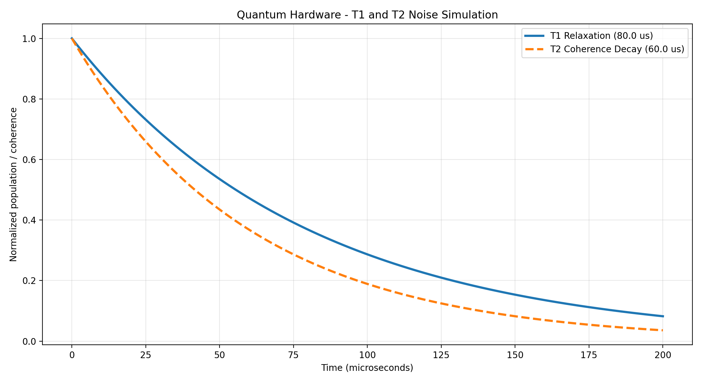
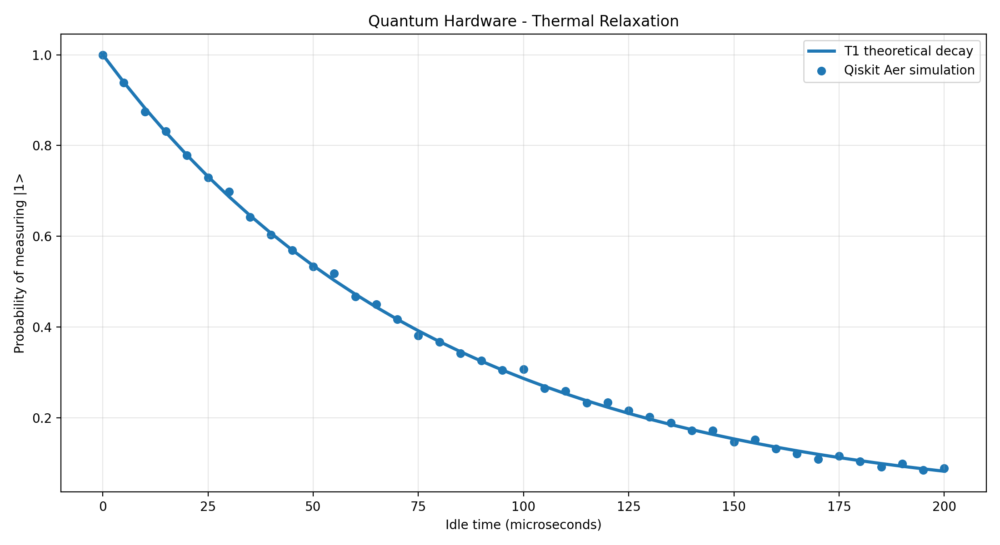
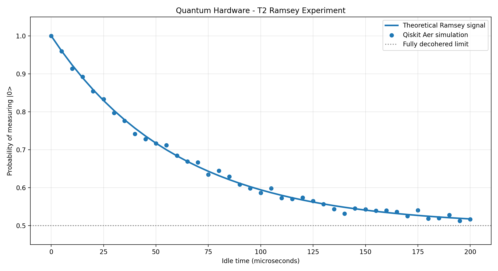
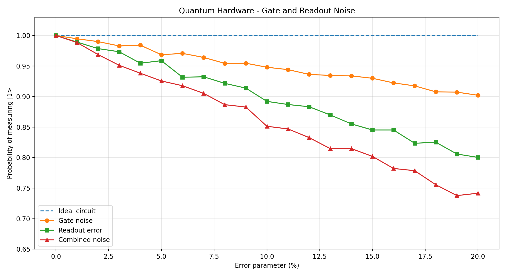

# Quantum Hardware & Noise Simulation Lab

### Quantum Computing | Qiskit Aer | Python | Quantum Hardware

A Python-based quantum computing research project focused on modeling and visualizing quantum hardware noise, relaxation, decoherence, and measurement errors.

This project demonstrates practical quantum simulation techniques using Qiskit Aer, NumPy, and Matplotlib.

## Research Objectives

- Model T1 energy relaxation and T2 coherence decay.
- Simulate thermal relaxation using Qiskit Aer.
- Investigate Ramsey-style coherence measurements.
- Analyze quantum gate errors and readout noise.
- Compare ideal theoretical models with noisy quantum simulations.

## Technologies

- Python
- Qiskit
- Qiskit Aer
- NumPy
- Matplotlib

## 1. T1 and T2 Relaxation

**Script:** `t1_t2_simulation.py`

Models exponential decay of excited-state population and quantum coherence.



## 2. Thermal Relaxation Simulation

**Script:** `thermal_noise.py`

Uses Qiskit Aer to simulate the effect of thermal relaxation on a single excited qubit.



## 3. Ramsey Coherence Experiment

**Script:** `ramsey_experiment.py`

Simulates a Ramsey-style experiment to investigate T2 coherence decay using Hadamard gates and a thermal relaxation noise model.



## 4. Quantum Gate and Readout Noise

**Script:** `gate_readout_noise.py`

Investigates depolarizing gate noise, symmetric readout errors, and their combined impact on measurement outcomes.



## Installation

Install the required Python packages:

```bash
pip install qiskit qiskit-aer numpy matplotlib
```

## Running the Simulations

Run each experiment independently:

```bash
python t1_t2_simulation.py
python thermal_noise.py
python ramsey_experiment.py
python gate_readout_noise.py
```

Each script generates a PNG visualization.

## Scientific Background

### T1 Energy Relaxation

T1 describes the characteristic timescale for an excited qubit to relax toward its ground state.

For an initially excited qubit:

P(1, t) = exp(-t / T1)

### T2 Coherence Decay

T2 describes the characteristic decay time of transverse quantum coherence.

C(t) = exp(-t / T2)

For a standard relaxation-and-dephasing model:

T2 <= 2 * T1

### Quantum Hardware Noise

Real quantum processors experience several sources of error, including:

- Energy relaxation
- Dephasing
- Imperfect quantum gates
- Measurement errors

Understanding these mechanisms is essential for quantum hardware characterization, noise-aware algorithms, and quantum error correction.

## Related Project

[Quantum Error Correction Lab](https://github.com/Tamas22-cell/quantum-error-correction-lab)

## Research Roadmap

- [x] T1 and T2 analytical simulation
- [x] Thermal relaxation with Qiskit Aer
- [x] Ramsey coherence simulation
- [x] Gate and readout noise analysis
- [ ] Hardware-inspired noise calibration
- [ ] Multi-qubit noise simulation
- [ ] Automated validation and benchmarking
- [ ] Interactive quantum noise dashboard

## Author

Quantum AI Research Lab

GitHub: [Tamas22-cell](https://github.com/Tamas22-cell)

Portfolio: https://quantum-ai-showcase.vercel.app

---

*Quantum Hardware & Noise Simulation Lab — Quantum Developer Research Portfolio*
